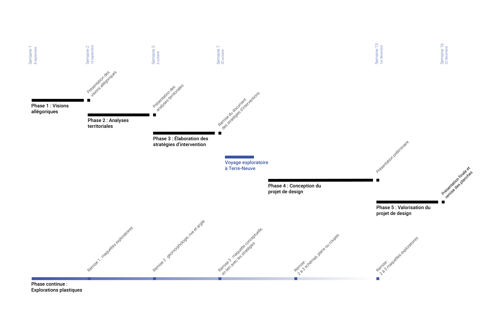

# Readme 2022
# GitHub 
L’un des objectifs fondamentaux de cet atelier est d’expérimenter, tant pour ce qui est des thématiques de recherche, des stratégies d'apprentissages, des projets imaginés ou encore des outils pédagogiques utilisés. De plus, à l'image des projets pilotés par la Chaire, nous avons la volonté de supporter un certain type d'initiatives : collective, transparente et démocratique.

GitHub incarne ces désirs d'expérimentations et d'ouverture. Nous vous invitons à tester avec nous les potentiels de cet outil pour un atelier de design et recherche. Cette plateforme permet non seulement d’échanger et organiser notre travail, mais également de rassembler et construire des connaissances collectivement. L'idée est également de se familiariser concrètement aux défis du numérique. En ce sens, GitHub force une « hygiène numérique » du travail collaboratif qui inclue l’organisation et la gestion des dossiers et fichiers mais aussi le choix des formats, la taille des fichiers, la nature des fichiers, etc.

GitHub sera utilisé tout au long de l’atelier afin de structurer le travail à accomplir, déposer les livrables et rassembler différents savoirs et apprentissages.

Une séance de formation est prévue en début de session afin de vous familiariser avec la plateforme.

**Important**
* Télécharger [GitHub Desktop](https://desktop.github.com/) pour faciliter l'utilisation.
* Télécharger [ZETTLR](https://www.zettlr.com/) pour vous permettre d'écrire et mettre en page vos textes plus facilement.

## Système d’organisation du repository
Simplement, chacune des phases de l'atelier possède un dossier (_file_) dans lequel certains documents ou données pertinentes y sont déposés pour vous accompagner dans votre travail.

De plus, comme il s'agit d'un travail collectif, nous allons discuter entre nous les façons d'y ajouter le résultat de vos explorations ou recherches documentaires.

Finalement, chaque dossier possède également un/ des sous-dossier(s) pour y déposer les livrables de l'atelier.

## Système de nomenclature des fichiers

nom_de_famille-type_de_document-nom_du_document-aaaammjj

    Ex: koseki-image-bonne_gouvernance-20210901.jpg 

# Syllabus Écométropole Laurentienne

## Informations générales

Cours : Atelier de design urbain 2 (6 crédits)
Sigle : AME6415
Site StudiUM : https://studium.umontreal.ca/
Faculté : Aménagement
Trimestre : Automne
Année : 2022

### Mode d’enseignement
Lors de son lancement, le jeudi 8 septembre 2022, l’Université prévoit un enseignement en atelier pour toutes les séances du semestre. Pour plus d’information concernant les modes d’enseignement en cours vous pouvez consulter le site de l’Université : https://registraire.umontreal.ca/etudes-et-services/horaire-des-cours/modes-denseignement/ 

### Déroulement de l’atelier
Lors de son lancement, le jeudi 8 septembre 

### Déroulement du cours
* Atelier : Lundi et jeudi de 13 h à 17 h, local à confirmer (Aménagement)
* Deux conférences lors du trimestre
* Voyage exploratoire de recherche par le design à Terre-Neuve, du 22 au 30 octobre 2022

### Charge de travail hebdomadaire
* Présence à l’atelier obligatoire : 9 heures par semaine (sauf congés)
* Travail en dehors des heures d’atelier : 9 heures par semaine

### Personnel enseignant
[Shin Koseki](https://shinkoseki.com/), Dr Sc, Dipl Arch EPF | shin.koseki@umontreal.ca
Professeur adjoint à l’École d’urbanisme et d’architecture du paysage et directeur titulaire de la Chaire UNESCO en paysage urbain. (Il/Lui/Le). 

Emile Forest | emile.maheu.forest@umontreal.ca 
Chargé de formation pratique à l’École d’urbanisme et d’architecture du paysage et agent de recherche, Chaire UNESCO en paysage urbain. (Il/Lui/Le). Cofondateur, coordonnateur général et concepteur de jardin chez [Nouveaux Voisins](https://www.nouveauxvoisins.org/).

# Description du cours

## Place du cours dans le programme 
Ce cours, obligatoire pour les personnes inscrites au programme de maîtrise en aménagement avec l’option design urbain, constitue le second atelier de design du cursus et prépare ainsi à l’atelier de projet final. Ce cours peut aussi être suivi par d’autres personnes étudiant à la Faculté de l’aménagement dans le cadre de leur formation à la maîtrise. Il n’y a aucun préalable formel à la participation à l’atelier. Toutefois, une forte habilité au design, et une compréhension des enjeux d’aménagement urbain et territorial sont mobilisées tout au long du cours. 

Offert à la deuxième année de la maîtrise, l’atelier de design urbain 2 se focalise sur le développement de compétences de design complexe, notamment par un processus de recherche et d’élaboration de stratégies publiques par le design. 

## Design urbain à la Chaire UNESCO
La Chaire UNESCO en paysage urbain ainsi que l’équipe d’enseignement de l’atelier définissent le design urbain tant comme la conception de lieux réels que la conceptualisation de futurs souhaités et leurs matérialisations spatiales à différentes échelles. Ainsi, en plus de s’intéresser à différents objets d’intervention conventionnels, tel qu’une place publique ou la configuration d’un développement urbain, le design urbain tel que défini ici est un outil de recherche et de prospection. Il permet à la fois d’étudier les incidences spatiales de phénomènes complexes qu’imaginer les réponses aménagistes possibles aux grands défis de notre époque ; des interventions qui s’intéressent tant aux expériences urbaines sensibles qu’à l’organisation biorégional de territoires urbanisés.

# L’atelier : Écométropole Laurentienne

## Contexte académique : Le projet Fluvialités
Piloté par la Chaire UNESCO en paysage urbain, le projet Fluvialités s’intéresse à l’urbanisation des grands fleuves et delta en contexte de crise climatique. En plus d’être un assemblage d’écosystèmes uniques et diversifiés, ces vastes espaces hydrologiques structurent l’occupation territoriale et sont la source de biens des phénomènes culturels, identitaires et économiques. Les changements climatiques affectent particulièrement ces géographies aquatiques et riveraines. Cela se matérialise par des inondations plus fréquentes, l’augmentation de la température de l’eau, l’érosion grandissante des berges, la disparition d’espèces indigènes et l’apparition d’espèces exotiques envahissantes — pour ne nommer que ces impacts. Ces récents bouleversements forcent alors à questionner en profondeur les façons d’habiter et cohabiter avec ces vastes territoires et leurs écosystèmes.

Si une diversité de connaissances dans les domaines de la restauration écologique ou de la résilience territoriale sont déjà accessibles afin d’évaluer et mitiger les risques posés par cette situation, il y a aujourd’hui une nécessité de mieux intégrer ces travaux aux projets de design et d’aménagement des territoires riverains et côtiers. Plus encore, les savoirs actuels et futurs permettant de préserver et soutenir les écosystèmes des fleuves et deltas offrent aux architectes, architectes paysagistes, designers urbains et urbanistes de nouveaux points de départ pour appréhender le projet aménagiste. Il s’agit ainsi d’une réelle opportunité d’intégrer ces connaissances afin de repenser radicalement notre rapport à l’habiter fluvial. Cet atelier propose alors d’explorer ces nouveaux potentiels pour le projet de design en contexte fluvial. C’est-à-dire de formuler un projet de design territorial en parallèle à une construction collective de savoirs liés aux géographies complexes du Fleuve Saint-Laurent et les défis écologiques, éthiques, démocratiques et économiques qu’elles doivent surmonter. 

## Contexte territorial : Le Golfe du Saint-Laurent

_Le Golfe de Saint-Laurent, dressé sur plusieurs arpentages modernes et autres matériaux liés par des observations astronomiques. Créateur : Jean Le Rouge, 1779. BAnQ Numérique. _

Sans vision, le développement urbain aux abords du fleuve Saint-Laurent et de ses affluents précipite cette région du monde droit vers une catastrophe écologique, économique, sociale et politique. Treizième plus grand fleuve au monde en termes de débit d’eau, le Saint-Laurent joue un rôle clé dans la régulation du climat à l’échelle mondiale. Son bassin hydrographique draine à lui seul plus d’un quart des réserves d’eau potable au monde, et plus de la moitié de la population du Canada et un tiers de la population des États-Unis s’y abreuvent et s’en nourrissent. Habité depuis plusieurs millénaires par différents peuples autochtones d’Amérique du Nord, le fleuve Saint-Laurent agit, depuis la colonisation, comme le principal vecteur économique des deux pays qui l’englobe aujourd’hui. La présence humaine croissante, l’industrialisation et sa périurbanisation ont largement perturbé son fonctionnement écologique, y réduisant l’empreinte de la faune et de la flore. 

L’atelier vise à documenter les interrelations complexes et changeantes entre différents écosystèmes et différentes communautés riverains dans le contexte climatique actuel afin de proposer des solutions durables aux enjeux écologiques, économiques et sociaux de la région du Golf du Saint-Laurent. 

L’un des objectifs de l’atelier est d’investir la relation trouble qui existe entre les multiples communautés du Golf et les ressources naturelles, voir plus largement la Nature. Si ces différents territoires proposent des paysages nationaux emblématiques ainsi que des fonctions écologiques importantes, leurs économies sont toutefois encore aujourd’hui largement centrées sur l’extraction des ressources. Cette relation d’interdépendance devient alors un point de départ inspirant pour imaginer différents projets de design qui questionnent nos façons de cohabiter avec la nature en contexte fluvial. À cette fin, l’atelier développe une série de stratégies d’aménagement et de design à plusieurs échelles : le territoire fluvial, l’ensemble urbain, le quartier et l’espace public. Ensemble, ces stratégies forment les réponses pratiques à une vision pour le futur du golfe du Saint-Laurent, tant pour les humains et non-humains qui l’habitent. 

# Apprentissages visés
## Intentions pédagogiques
L’atelier de design urbain 2 vise à affiner les compétences des personnes étudiantes dans le domaine du design urbain et à les initier aux pratiques de recherche et de gouvernance par le design. Il entend ainsi développer leur maîtrise des outils de conception et de représentation du projet à plusieurs échelles, en y intégrant une lecture critique du contexte écologique, économique, social et politique. Enfin, il tient ainsi à faire d’elles des acteurs aux échelles locales, régionales, nationales et internationales.

## Compétences
À la fin de cet atelier, la personne étudiante pourra : 

* Évaluer ses forces et ses faiblesses dans l’acquisition des objectifs d’apprentissage qui suivent.
* Écouter les commentaires de pairs et d’enseignants afin d’améliorer son travail.
* Créer des conditions propices : à l’apprentissage ; au travail individuel ; au travail d’équipe ; au travail de groupe.
* Gérer un projet en identifiant les tâches à effectuer ; planifiant son travail de manière réaliste ; utilisant les outils adaptés de manière efficace ; partageant de manière efficiente la charge de travail ; exécutant ses tâches dans les délais définis.
* Gérer les documents relatifs à un projet en : créant une arborescence de documents numériques partagés ; créant une nomenclature de fichiers et de dossier cohérente et universelle ; documentant et archivant ceux-ci.
* Manipuler dans un logiciel spécialisé des fichiers : texte (p. ex.. docx dans Word) ; tableaux (p. ex.. xls dans Excel) ; présentation (p. ex.. pptx dans PowerPoint) ; images (p. ex.. psd dans Photoshop) ; dessin vectoriel (p. ex.. ai dans Illustrator) ; mise en page (p. ex.. indd dans InDesign) ; cartographiques (p. ex.. shp dans QGis) ; dessin CAD (p. ex.. dwg dans Archicad) ; tridimensionnels.
* Effectuer de la recherche d’information à partir de : documents ; archives ; renseignements ; entretiens.
* Identifier à partir de recherche d’information des enjeux urbains et territoriaux : écologiques ; économiques ; politiques ; sociaux.
* Construire à partir d’enjeux urbains et territoriaux une problématique complexe.
* Produire des schémas et des graphes simples et efficaces à partir de : données tangibles (qualitatives ou quantitatives) ; modèles approximatifs ; objectifs approximatifs.
* Représenter un contexte ou un projet à l’aide de techniques spécifiques aux domaines de l’aménagement et du design : plans, coupes, élévations ; axonométries ; perspectives ; dessins techniques ; maquette analogue ; maquette tridimensionnelle.
* Présenter oralement de manière simple et concise : des intentions d’analyses territoriales et urbaines ; des données et des informations pertinentes aux analyses territoriales et urbaines ; une série d’analyses territoriales et urbaines ; des intentions de projet de design complexe ; projet de design complexe.
* Concevoir et documenter des aspects du projet de design à l’aide de maquettes analogues.
* Créer et organiser des modélisations tridimensionnelles dans un logiciel spécialisé.
* Valoriser son projet : lors de discussion informelle ; lors de présentations formelles ; sur les réseaux sociaux.
* Produire un ensemble de documents graphiques et textuels présentant : projet de design complexe ; une série d’analyses territoriales et urbaines.
* Valoriser son projet : lors de discussion informelle ; lors de présentations formelles ; sur les réseaux sociaux.

# Organisation de l’atelier
## Phase 1 : Visions allégoriques
Chaque membre de l’atelier produit individuellement deux visions allégoriques illustrant les conséquences d’une bonne et d’une mauvaise gouvernance et utilisation du Fleuve à l’horizon 2100. Les membres réalisent ces deux visions sous la forme d’une collection d’images, de représentations paysagères et/ou maquette(s) exploratoires. 

Lors de la séance du 8 septembre, l’équipe d’encadrement introduira l’exercice aux membres de l’atelier qui auront jusqu’au 15 septembre pour compléter leurs visions allégoriques. Lors de la séance du 15 septembre, l’atelier sera transformé en « mini-exposition » où chaque membre de l’atelier exposera ces visions allégoriques. L’équipe d’encadrement et tous les membres du groupe effectueront une tournée de l’exposition et donneront un retour critique sur les deux visions proposées.

## Phase 2 : Analyses territoriales
Afin de convertir les préoccupations du groupe en connaissances pouvant être mobilisées dans le processus de design, certaines thématiques d’analyse sont identifiées de façon collective. Ensuite, des équipes de deux sont formées et deviennent responsables de l’une des thématiques de recherche identifiées.

Chaque équipe mène alors une recherche documentaire, archivistique et se renseigne auprès de sources probantes qu’elle aura identifiées afin de détailler leur thématique. À partir des informations collectées, les équipes construisent un portrait de la problématique et présentent certains défis territoriaux qu’elle soulève — des défis pouvant inspirer un projet de design. Ces connaissances sont rassemblées dans une présentation s’appuyant sur différentes iconographies (p. ex. cartes, illustrations, schémas conceptuels, infographies, etc.) afin de bien partager les données découvertes, leurs constats et les défis aménagistes identifiés. 

Les équipes présentent et remettent leur document de présentation lors de la séance du 6 octobre. Ensemble, l’équipe d’encadrement et tous les membres du groupe pourront donner un retour critique sur ces analyses et les défis proposés afin d’identifier des pistes de stratégies pouvant y répondre.

## Phase 3 : Élaboration des stratégies d’intervention
Cette phase d’élaboration des stratégies est une étape collective de l’atelier de design. L’idée est de profiter de la petite taille du groupe afin de travailler, débattre, prioriser et co-construire les stratégies politiques et territoriales les plus pertinentes pour le Golfe. 

L’ensemble du groupe doit alors travailler en équipe afin de rassembler les défis et problématiques soulevées lors de la seconde phase et développer des stratégies spatiales pouvant y répondre. Les implications territoriales des stratégies doivent être localisées dans le golfe du Saint-Laurent et ses territoires côtiers. Il est également important que les différentes stratégies prennent en compte différentes échelles territoriales : de l’écorégion jusqu’à l’expérience sensible.

Au terme de cette phase, le groupe doit remettre un court document qui détaille les stratégies formulées. Pour chacune de ces stratégies, des études de cas inspirants doivent être présentées en exemple et des territoires stratégiques d’interventions dans le Golfe doivent être identifiés. Ce document doit être remis et présenté, de la manière que le groupe le souhaite, lors de la séance du 20 octobre. Si le livrable est clair, la façon de le construire sera déterminée et coordonnée par le groupe. 

## Phase 4 : Conception du projet de design
Cette phase est dédiée à la conception d’un projet de design urbain pour un territoire spécifique du golfe du Saint-Laurent qui concrétise spatialement certaines des stratégies identifiées à la phase 3. 

De retour en binôme jusqu’à la fin de la session, les équipes ont la liberté de choisir les stratégies qui les intéressent ainsi que leur territoire d’intervention. Il est aussi libre à chacun d’imaginer comment leur projet de design s’articule entre différentes échelles territoriales selon le contexte sélectionné. Suivant un principe de durabilité, les projets de design proposés doivent être sensibles à l’utilisation des ressources qu’ils utilisent en lien aux retombées escomptées. Ils doivent également, en s’appuyant sur les informations accessibles, répondre aux préoccupations et besoins des communautés qui habitent les régions et les localités où se situe l’intervention.

Cette phase débute avec la sélection préliminaire de lieux potentiels d’interventions pertinents en lien aux stratégies préconisées. Ensuite, une série d’exercices hebdomadaires associés à différentes techniques de représentation du projet de design/projet de paysage (p. ex. plan, coupe, maquette et perspectives d’ambiance) permet de raffiner la spatialité et matérialité des propositions. Une présentation préliminaire du projet, s’appuyant sur les différentes productions graphiques conçues, clôt cette quatrième phase de l’atelier. Il s’agit d’un moment important afin de colliger les commentaires de l’équipe d’encadrement et ses pairs afin de bonifier son projet de design en vue de la critique finale. 

## Phase 5 : Valorisation du projet de design
Suite aux présentations préliminaires des projets, la dernière phase de l’atelier vise à peaufiner tant les interventions en tant que telles que le narratif et le support visuel détaillant le projet. Les équipes produisent alors les documents graphiques et les textes nécessaires pour valoriser leur projet auprès d’un jury externe composé de professionnels de l’aménagement. 

Les étudiants doivent faire preuve d’originalité et s’appuyer sur des systèmes de représentation récents ou novateurs afin de produire un langage visuel en accord avec les intentions du projet et les standards d’excellence dans les disciplines du design.

## Phase continue : Explorations plastiques
En parallèle aux activités principales de la phase 1, 2 et 3, trois heures des neuf heures prévues en dehors des heures de classe doivent être dédiées à différentes exploitations plastiques. Ainsi, trois activités de création de maquettes sont prévues lors de cette phase : (1) des maquettes plus exploratoires qui permettent d’accompagner votre propos lors de l’exposition des visions allégoriques ; (2) des maquettes de la géomorphologie des rives, fabriquée en utilisant de l’argile lors de la phase d’analyses territoriales ; (3) et une maquette plus conceptuelle qui présente la matérialisation territoriale d’une stratégie d’intervention.

L’objectif de cette phase continue d’explorations plastiques est de vous permettre de tester de nouvelles approches de design et de représentation de manière plus libre et expressive. 

# Ligne du temps

 
# Activités complémentaires
## Voyage exploratoire à Terre-Neuve (22 au 30 octobre 2022)
En collaboration avec différents acteurs, comme l’artiste et chercheur David Maggs originaire de Corner Brook, la Chaire UNESCO en paysage urbain invite les étudiants de deuxième cycle de la Faculté de l’aménagement de l’Université de Montréal à participer à un voyage de recherche d’une semaine dans la région du parc national du Gros-Morne, à Terre-Neuve. Plutôt que de fonctionner comme un atelier de design classique, soit une course effrénée vers la production d’un projet d’intervention, l’objectif ici est d’investir les potentiels d’un atlas territorial et de produire un document collectif. Comme certains auteurs avancent, la crise climatique est non seulement une crise écologique, économique et technologique, mais également une crise culturelle. La complexité ainsi que l’immensité des causes et impacts du réchauffement planétaire nous obligent à repenser nos modes de représentations. Il devient impératif de rendre compréhensibles les transformations climatiques en cours et leurs incidences sur nos modes d’habiter. Le voyage à Terre-Neuve souhaite explorer les potentiels d’un atlas territorial qui se structure moins autour des descriptions d’un espace données, mais plutôt de ses potentielles transformations.

Le parc national Gros-Morne a été fondé en 1970 et est un site du Patrimoine mondial de l’UNESCO. La région est pourtant habitée depuis 2500 av. J.-C., où les premiers peuples de la culture archaïque maritime habitaient le territoire. Un peuple de chasseurs-cueilleurs qui s’approvisionnent principalement à même le golfe du Saint-Laurent. Aujourd’hui, les 1805 km2 du parc national encerclent huit communautés. Et si sur la terre ferme se situe cette immense réserve naturelle dont les paysages spectaculaires sont reconnus mondialement, le golf du Saint-Laurent accueille quant à lui diverses activités extractives associées aux pêches industrielles, pétrole et gaz naturels. Cette région se présente comme un site d’exception pour documenter les interrelations complexes et changeantes entre différents écosystèmes et différentes communautés côtières.

## Cycle de conférences
Afin d’aider les membres du groupe à élargir leurs compréhensions des enjeux du design urbain en lien avec les grands fleuves, la Chaire UNESCO en paysage urbain organise deux conférences sur le sujet. La participation de tous les membres du groupe est très fortement encouragée.

# Pondération et grille de correction
* Présentation des visions allégoriques (phase 1) : 10 %
* Présentation des analyses territoriales (phase 2) : 10 %
* Schémas, plans et coupes produits à la phase 4 : 5 %
* Maquettes exploratoires produites à la phase 4 : 10 %
* Présentation préliminaire (phase 4) : 15 %
* Présentation finale devant jury (phase 5) : 40 %
* Participation aux différentes activités collectives et aux explorations plastiques : 10 %
L’évaluation se fait à titre individuelle sur la base des objectifs d’apprentissages définis plus haut et selon les barèmes suivants : 

| | Sans amélioration | Avec amélioration | Avec grande amélioration |
|-|-|-|-|
| Excellent | A- | A | A+ |
| Très bien | B-| B | B+ |
| Bien | C- | C | C+ |
| Passable | . | D | D+ |
| Faible | E |
| Échec | F |

# Information de l’Université de Montréal

## Exigences du cours AME 6415
Aucune exigence spécifique

## Période allouée à l’appréciation de la prestation de l’enseignement
Une période pour procéder à l’appréciation de l’atelier est prévue le 15 novembre à 13 h. Vous devriez recevoir un courriel ou un message sur StudiUm, dès le 15 novembre au matin, pour signifier l’ouverture de la prestation en ligne sur la plateforme Omnivox et vous informer de la procédure pour y accéder. 

## L’intégrité, la fraude et le plagiat
Pour prévenir les conséquences du plagiat, l’Université met à la disposition des étudiants sur le site de l’information, des réflexions, des conseils pratiques et des références portant sur l’intégrité, la fraude et le plagiat : https://integrite.umontreal.ca/accueil/.

## Soutien aux étudiants en situation de handicap
L’Université de Montréal offre des services de soutien aux étudiants en situation de handicap, dont des mesures d’accommodement aux examens. Les étudiants désirant se prévaloir de ces services doivent s’inscrire auprès du Service d’aide aux étudiants (SAE) : http://www.bsesh.umontreal.ca/accueil/index.htm.

## Le Carrefour Numérique
Le Carrefour numérique est un espace de ressources en ligne pour tous les étudiants des programmes professionnels de la Faculté de l’aménagement. Conçu pour soutenir l’apprentissage et l’intégration des outils et des stratégies numériques dans la création, la représentation et la communication des projets dans les ateliers, le Carrefour est composé de capsules de formation et d’un environnement favorisant le développement des compétences numériques, la participation des étudiants et le partage de connaissances.

Les capsules du carrefour numérique sont organisées [par logiciels](https://studiumfc.umontreal.ca/pluginfile.php/646375/mod_resource/content/11/index.html#$2) ou [par programmes et cours](https://studiumfc.umontreal.ca/pluginfile.php/646375/mod_resource/content/11/index.html#$1)

## Absence à une évaluation
L’étudiant.e doit aviser de son absence à l’évaluation dans les plus brefs délais. Tout.e étudiant.e qui doit s’absenter à un examen ou à une évaluation doit obligatoirement compléter le formulaire prévu à cet effet dans le centre étudiant [CHE_Absence_Évaluation]. Il est à noter que la section 5 du formulaire constitue une obligation pour l’étudiant.e de prendre connaissance des règlements et notamment de contacter les enseignants responsables.

# Références/ bibliographie

## Écologie
* Graham, J., Blanchfield, C., Anderson, A., Carver, J., & Moore, J. (Eds.). (2016). Climates: Architecture and the Planetary Imaginary. Columbia Books on Architecture and the City.
* Angelo, H., et Wachsmuth, D. (2015). Urbanizing Urban Political Ecology: A Critique of Methodological Cityism. International journal of urban and regional research, 39(1), 16–27.

## Essais politiques
* Latour, B. (2017). Où atterrir ? : comment s’orienter en politique. La découverte, Paris.

## Géographie, études urbaines et architecture
* Brenner, N. (2014). Implosions/explosions. Berlin : Jovis.
* Brenner, N., et Schmid, C. (2015). Towards a new epistemology of the urban? Cityscape, 19 (2–3), 151–182
* Breux, S., et Poitras, C. (s. d.). Saisir la ville matérielle et idéelle. Dans G. Cloutier, J.-P. Collin, et C. Poitras (éd.), Dix ans d’études urbaines au Québec : Bilan et perspectives d’avenir (p. 73-95). Québec : Presses de l’Université Laval
* Cavalieri, C. et Vigano, P. (2020). The Horizontal Metropolis: A Radical Project. Park Books.
* Corner, J., et Hirsch, A. B. (2014). The Landscape Imagination: Collected Essays of James Corner, 1990–2010. New York: Princeton Architectural Press.
* Diener, R., Herzog, J., Meili, M., De Meuron, P., & Schmid, C. (2013). Switzerland–an Urban Portrait: Vol. 1: Introduction; Vol. 2: Borders, Communes–a Brief History of the Territory; Vol. 3: Materials. Walter de Gruyter.
* Di Palma, V. (2014). Wasteland: A History. New Haven: Yale University Press.
* Easterling, K. (2014). Extrastatecraft: The Power of Infrastructure Space. Verso Books.
* Éthier, G. (2022). La ville analogique, repenser l’urbanité à l’ère numérique. Atelier 10, Montréal.
* Gandy, M. (2014). The Fabric of Space: Water, Modernity, and the Urban Imagination. Cambridge : MIT Press.
* Gandy, M. (2016). Unintentional landscapes. Landscape Research, 41(4), 433–440.
* Ibañez, D., Hutton, J., & Moe, K. (Eds.). (2019). Wood urbanism: From the molecular to the territorial. Actar Publishers.
* Ibañez, D., Lyster, C., Waldheim, C., & White, M. (Eds.). (2017). Third Coast Atlas: Prelude to a Plan. Actar D, Inc.
* Jackson, J. B. (1984). Discovering the Vernacular Landscape. New Haven: Yale University Press.
* Koolhaas, R. (2017). Études sur (ce qui s’appelait autrefois) la ville. Paris : Payot et Rivages.
* Mattern, S. (2017). Code and Clay, Data and Dirt: Five Thousand Years of Urban Media. Minneapolis: University of Minnesota Press.
* Mostafavi, M. (2017). Agonistic Urbanism. Dans M. Mostafavi (éd.), Ethics of the urban: The city and the spaces of the political (p. 9–16). Zürich: Lars Müller Publisher.
* Picon, A. (2000). Anxious Landscapes: From the Ruin to Rust. Grey Room, 64–83. 
* Venturini, G. (2019). Atlas of emerging practices: Being an architect in the 21st Century. Itinerant Office & New Generations.

## Récits
* Powers, R. (2018). The overstory: A novel. WW Norton & Company.
* Wulf, A. (2015). The invention of nature: Alexander von Humboldt’s new world. Knopf.

## Recherche visuelle et représentations graphiques
* Didi-Huberman, G. (2022). L’image survivante : histoire de l’art et temps des fantômes selon Aby Warburg. Éditions de Minuit, Paris.
* Ghosn, R., & Jazairy, E. H. (2018). Geostories: Another architecture for the environment. Actar.
* Tufte, R. E. (2001). The visual display of quantitative information. Cheshire, Conn. : Graphics Press.
* Waldheim, C., et Desimini, J. (2016). Cartographic Grounds: Projecting the Landscape Imaginary. San Francisco: Chronicle Books. 
* Waldheim, C., et Hansen, A. (2014). Composite Landscapes: Photomontage and Landscape Architecture. Hatje Cantz Verlag GmbH et Company KG.
* Yamaguchi, A. (2012). The Big Picture. Kyōto-shi : Seigensha.

##  Fleuve et golfe Saint-Laurent
* Série d’articles disponible à https://theconversation.com/ca-fr/topics/fleuve-saint-laurent-116908